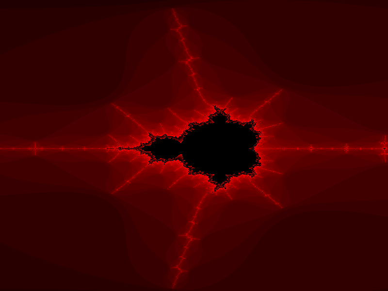
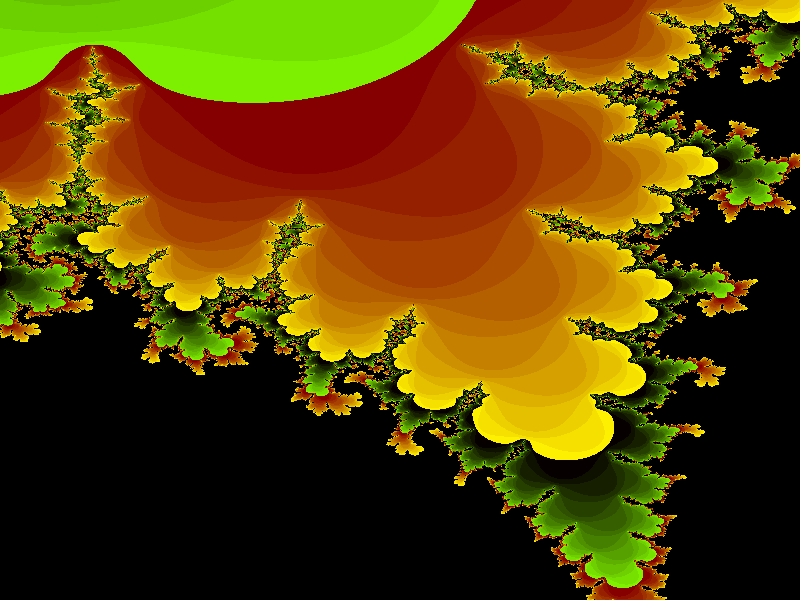

**Please note that there is a multi-threaded variant in the [multithread branch](https://github.com/rahra/intfract/tree/multithread) which makes use of multiple cores which gives an additional speed-up!**

# Calculating Fractals With Integer Operations

This program demonstrates how to use integers instead of floating point
operations using the example of fractal images.

Using integers in that way is specifically interesting if there is no FPU
available. The background is discussed in my article [»Calculating Fractals
With Integer
Operations«](https://www.cypherpunk.at/2015/10/calculating-fractals-with-integer-operations/).


## Implementation Variants

This package contains several implementations:

* `iterated.c` is a strait forward implementation of the iteration loop using `double`s.
* `iteratel.c` is an implementation of the same algorithm using integers of type `long` instead.
* `iterate.S` is an implementation done in Intel x86_64 assembler. It contains a traditional implementation using stack variables (`#define CONSERVATIVE`) and a high performance implementation.

Read my article [»Fractals And Intel x86_64
Assembler«](https://www.cypherpunk.at/2016/01/fractals-and-intel-x86_64-assembler/)
for implementation details of the assembler variant.

This package also contains the original variants in C and 68000 assembler
written on Amiga 500 around 1990.

# Theory: Calculating Fractals With Integer Operations

It was in the late ’80s when I started to become interested in
[fractals](https://en.wikipedia.org/wiki/Fractal). At the time then computers
were unbelievable slow compared to what we have today thus I tried to speed up
the algorithms in several ways.

This article is about using integer operations to calculate fractal images,
more specifically I’ll explain how to replace floating point operations by
integer operations (It is not about the theory behind fractals. There’s a lot
of literature about that.).

`(-1.82/-0.07) (-1.7/0.07)`

## History

I used an Amiga 500 computer which was an incredible system in the late ’80s.
The system design was far ahead of its time and also the performance was pretty
high. Intel PCs at the time then looked like an old rusty bicycle compared to
the Amiga computer. The Amiga’s core was a Motorola 68000 CPU which internally
was a full 32 bit microprocessor using the CISC design. Thus, it was a pleasure
to write assembler code compared to other CPUs. But still, most systems had no
floating point unit as it is common for modern computers of today. Thus floating
point operations had to be implemented in software.

## Background

CPUs internally have a set of registers (which could be considered as local
variables) of a fixed bit width. In case of the 68000 these are 32 bit wide
registers.[^1] Almost every CPU can execute the four basic arithmetical integer
operations add, subtract, multiply, and divide[^2] where the arguments to these
ops are the registers. Additionally there are logical operations such as bit
shifting.

Not all operations are executed at the same speed. Add/subtract and bit
shifting typically is faster than multiplications and divisions.[^3] All other
mathematical operations and functions have to be constructed using a sequence
of these basic arithmetic instructions and thus are obviously slower. Such
functions can be e.g. operations on integers which are longer than the native
bit size of the registers, floating point arithmetics, or even more complex
algorithms such as trigonometric functions or similar.

The goal is to avoid expensive operations particularly in the inner loops of
algorithms.

## Fixed Point Arithmetic

Replacing floating point operations by integer operations technically is a
fixed point arithmetic. That is that we move the decimal point to another fixed
position during the algorithm and finally move it back to get the result. This
sounds weird but is pretty easy explained with an example. Consider the two
random decimal numbers 3.14 and 0.69. If we add or muliply these two the
results are 3.83 = 3.14 + 0.69, and 2.16 = 3.14 * 0.69. Unfortunately our CPU
cannot deal with decimal numbers thus we loose the fractional part and in turn
we will loose a lot of precision: 3 = 3 + 0, and 0 = 3 * 0.

To solve this we move the decimal point 2 digits to the right. Mathematically this is
multiplying by 100 in this example. Thus 314 = 3.14 * 100 and 69 = 0.69 * 100.
Now we can add them since they are integer numbers: 383 = 314 + 69. To get the
result just divide by 100 again which is 3.83 = 383 / 100.

This works with any multiplier f. Every variable is considered to be multiplied
by f, e.g. a → a · f. We then have to make sure that the equations stay in
balance if the operands are multiplied by f.

If a + b = c then also a · f + b · f = c · f. At multiplications (a · b = c)
the result has to be divided by f again, because a · f · b · f = c · f², thus c
·f = (a · f · b · f) / f.

As already mentioned, multiplications and divisions are expensive, thus there
is another optimization. If the factor f is chosen to be a power of 2,
multiplications and divisions (of integer numbers) can be replaced by bit shift
operations. Shifting a number to the left by one bit is equal to multiplying
with 2.

`(-1.769/-0.05715) (-1.7695/-0.0567)`

## Application

The following code shows the inner loop which is executed for each pixel of a
fractal image.

```C
int iterate(double real0, double imag0)
{
   double realq, imagq, real, imag;
   int i;
 
   real = real0;
   imag = imag0;
   for (i = 0; i < MAXITERATE; i++)
   {
      realq = real * real;
      imagq = imag * imag;
      if ((realq + imagq) > 4)
         break;
 
      imag = real * imag * 2 + imag0;
      real = realq - imagq + real0;
   }
   return i;
}
```

There are several operations in it. To rewrite this to integer operations,
additions can be directly done as discussed before. The result of the
multiplications has to be shifted to the right by the number of bits which
expresses the multiplication factor. The functions is called with the
parameters real0 and imag0 already multiplied by f.

```C
int iterate(nint_t real0, nint_t imag0)
{
   nint_t realq, imagq, real, imag;
   int i;
 
   real = real0;
   imag = imag0;
   for (i = 0; i < MAXITERATE; i++)
   {
      realq = (real * real) >> NORM_BITS;
      imagq = (imag * imag) >> NORM_BITS;
 
      if ((realq + imagq) > (nint_t) 4 * NORM_FACT)
         break;
 
      imag = ((real * imag) >> (NORM_BITS - 1)) + imag0;
      real = realq - imagq + real0;
   }
   return i;
}
```

In this code snippet the cpp macro NORM_FACT represents the factor f and
NORM_BITS the number of bits. Thus NORM_FACT = 2<sup>NORM_BITS</sup>. Line
number 16 shows a bit shift to the right by just NORM_BITS – 1. This is because
the result is multiplied by two again which is a bit shift to the left by one.

## Limitations

Although this probably sounds great, there is a limitation and this is the
range of numbers. Integer numbers have a fixed width of bits and thus a maximum
number of different values.. If we use a multiplication factor as show above,
we can do arithmetics on fractional numbers and thus also on smaller numbers
between 0 and 1 but the maximum number of different values expressible by an
integer does still not change. A 32 bit integer has a range from -2147483648 to
2147483647. If we choose the factor f to be 2<sup>13</sup> = 8192, then the
tiniest fractional number is 1 / 8192 which is approx. 0.000122.

`(-1.3/0.03) (-1.24 0.1)`
 
# Fractals And Intel x86_64 Assembler

Some time ago I wrote this article about using integer operations to calculate
fractal images. Currently, I’m giving a course which prepares for malware
analysis. Among other things we deal a lot with Intel assembler and how
compilers create and optimize code.

The full code of everything discussed below (and also of the article referred
to above) is found here on Github.

One of the exercises was to write the integer version of the iteration function
manually in assembler. Here is the original version in C:

```C
int iterate(nint_t real0, nint_t imag0)
{
   nint_t realq, imagq, real, imag;
   int i;
 
   real = real0;
   imag = imag0;
   for (i = 0; i < MAXITERATE; i++)
   {
      realq = (real * real) >> NORM_BITS;
      imagq = (imag * imag) >> NORM_BITS;
 
      if ((realq + imagq) > (nint_t) 4 * NORM_FACT)
         break;
 
      imag = ((real * imag) >> (NORM_BITS - 1)) + imag0;
      real = realq - imagq + real0;
   }
   return i;
}
```

NORM_BITS, NORM_FACT, and MAXITERATE are preprozessor macros defining integer
constants, and nint_t is typedef’ed to long.

## Benchmark Setup

I did some benchmarks experimenting with several variants that the code could
be written in assembler. For the benchmark I used gettimeofday(2) directly
before and after calculating the image. The iteration loop is set to MAXITERATE
= 50 000 and I ran every attempt 5 times and then calculated the average time
value. At an image resolution of 640×400 the iteration loop would be executed
12.8×109 (12.8 billion) times in the worst case. At the given coordinates and
zoom level the iteration loop is actually executed 2.8×109 times.

I ran the programs directly on the console without X11 to avoid interference
with other tasks and to reduce the influence of multi-tasking as much as
possible.

As a time reference I used the original C program compiled with gcc option -O2.
I consider this time as 100%[^4] I used gcc version 4.9.2 on a 64 bit Intel
Core 2 Duo 1.2Ghz (family 6, model 15, stepping 13, ucode 0x3a). I observed
that the iteration loop is compiled in the same way, independently if optimized
with -O2 or -O3.

### Comparison

The benchmark showed that there are several different optimizations which
influence the performance, some of which are not really obvious. The following
listing shows the solution which performed most. It needs about 91,7% of the
time compared to the compiler’s optimized code. This is a huge improvement.

```IA64
   .section .text
   .align 16
   .global iterate
iterate:
   mov   $(4 * NORM_FACT),%rdx
   mov   %rdi,%r8             // real = real0
   mov   %rsi,%r9             // imag = imag0
 
   mov   $MAXITERATE,%ecx     // i = 64
   jmp   .Litloop
   .align 16
.Litloop:
   mov   %r8,%r10
   imul  %r10,%r10            // realq = real * real
   sar   $NORM_BITS,%r10      // realq >>= 13
 
   mov   %r9,%r11
   imul  %r11,%r11            // imagq = imag * imag
   sar   $NORM_BITS,%r11      // imagq >>= 13
 
   lea   (%r10,%r11),%rax     // realq + imagq
   cmp   %rdx,%rax            // > 4 * NORM_FACT ?
   jg    .Litbrk
 
   imul  %r8,%r9              // imag *= real
   sar   $(NORM_BITS - 1),%r9 // imag >>= NORM_BITS - 1
   add   %rsi,%r9             // imag += imag0
 
   sub   %r11,%r10            // realq - imagq
   lea   (%rdi,%r10),%r8
    
   dec   %ecx                 // i--
   jne   .Litloop
 
.Litbrk:
   mov   $MAXITERATE,%eax     // 64 - i
   sub   %ecx,%eax
   ret
```

## Important Optimizations

The inner loop is between line numbers 12 and 33. The first important
improvement is that the loop, i.e. the target of the branch in line #33 shall
be aligned to 16 bytes. This is according to the »Intel 32/64 Optimization
Reference Manual« and this is also done by the compilier’s optimizer. The
benchmark showed that if it is not properly aligned that the runtime is at
93,9% which is more than 2% slower.

Line #32 and #33 shows the loop counter decrement and the conditional branch.
Although the Intel core provides a LOOP instruction the benchmark shows that
using LOOP is significantly slower than doing a DEC/JNE combination,
independently if the target is properly aligned or not. The execution time with
LOOP is at about 96,6%. If we use SUB $1,%ecx it slightly slower, about 0,2%.

Another trick which gains performance is to use the LEA instruction instead of
a MOV/ADD combination. LEA actually is a three-operand instruction. Line #21 is
equivalent to

```IA64
mov   %r10,%rax
add   %r11,%rax
```

## Conclusion

There are many reasons to not write any code in assembler today. But although
modern code optimizers are highly efficient, manual written code with
thoroughly chosen instructions may still perform better.


[^1]: The Intel i286 had 16 bit registers, the i386 up to the Pentium
  generation had 32 bit registers, and modern Intel cores have 64 bit
  registers. In the embedded area a lot of 8 bit CPU are in uses such as e.g.
  the AVR cores, or the 8051-based cores.
[^2]: E.g. the AVR core has no divide instruction.
[^3]: On the M68000 a multiplication used up to 70 CPU cycles in contrast to an
  addition which took just 4 to 8 cycles. 
[^4]: The absolute time on my computer was slightly more than 30 seconds for
  one run.

