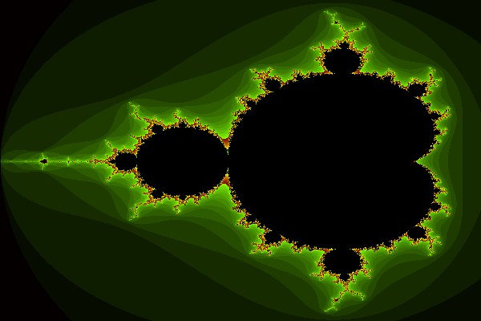
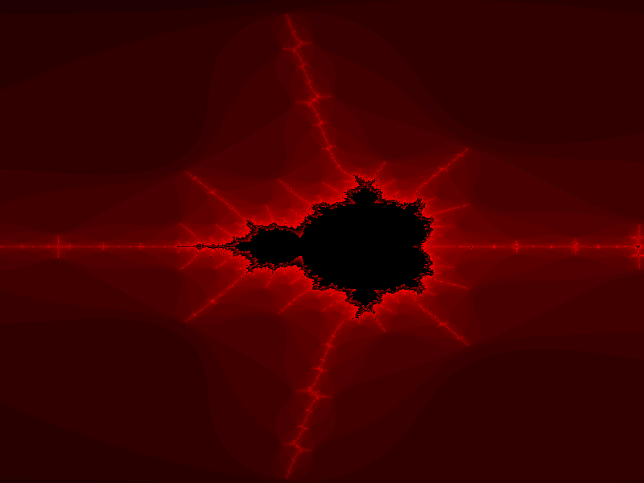
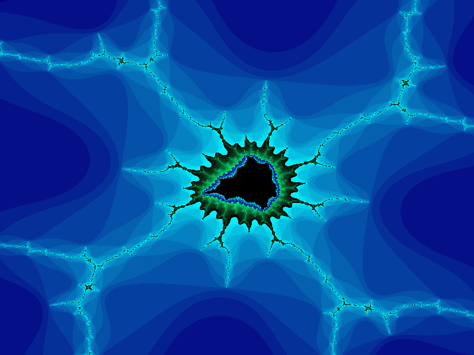
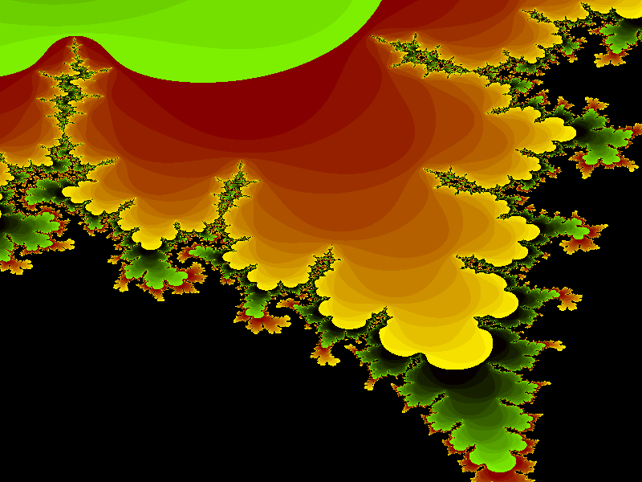

# Calculating Fractals With Integer Operations

This program demonstrates how to use integers instead of floating point
operations using the example of fractal images.

Using integers in that way is specifically interesting if there is no FPU
available. The background is discussed in my article [»Calculating Fractals
With Integer
Operations«](https://www.cypherpunk.at/2015/10/calculating-fractals-with-integer-operations/).



## Implementation Variants

Have a look at the file `config.h` to modify the following options.
The code by default is configured to be multithreaded, making use of parallization on multiple CPUs.
This package contains several implementation variants of the inner loop in the following files:

* `iterated.c` is a strait forward implementation of the iteration loop using `double`s.
* `iteratel.c` is an implementation of the same algorithm using integers of type `long` instead.
* `iterate.S` is an implementation done in Intel x86_64 assembler.
* `iterate.cl` is an OpenCL implementation for massive parallization.

Read my article [»Fractals And Intel x86_64
Assembler«](https://www.cypherpunk.at/2016/01/fractals-and-intel-x86_64-assembler/)
for implementation details of the assembler variant.

This package also contains the original variants in C and 68000 assembler
written on Amiga 500 around 1990.

# Theory: Calculating Fractals With Integer Operations

It was in the late ’80s when I started to become interested in
[fractals](https://en.wikipedia.org/wiki/Fractal). At the time then computers
were unbelievable slow compared to what we have today thus I tried to speed up
the algorithms in several ways.

This article is about using integer operations to calculate fractal images,
more specifically I’ll explain how to replace floating point operations by
integer operations (It is not about the theory behind fractals. There’s a lot
of literature about that.).

`(-1.82/-0.07) (-1.7/0.07)`

## History

I used an Amiga 500 computer which was an incredible system in the late ’80s.
The system design was far ahead of its time and also the performance was pretty
high. Intel PCs at the time then looked like an old rusty bicycle compared to
the Amiga computer. The Amiga’s core was a Motorola 68000 CPU which internally
was a full 32 bit microprocessor using the CISC design. Thus, it was a pleasure
to write assembler code compared to other CPUs. But still, most systems had no
floating point unit as it is common for modern computers of today. Thus floating
point operations had to be implemented in software.

## Background

CPUs internally have a set of registers (which could be considered as local
variables) of a fixed bit width. In case of the 68000 these are 32 bit wide
registers.[^1] Almost every CPU can execute the four basic arithmetical integer
operations add, subtract, multiply, and divide[^2] where the arguments to these
ops are the registers. Additionally there are logical operations such as bit
shifting.

Not all operations are executed at the same speed. Add/subtract and bit
shifting typically is faster than multiplications and divisions.[^3] All other
mathematical operations and functions have to be constructed using a sequence
of these basic arithmetic instructions and thus are obviously slower. Such
functions can be e.g. operations on integers which are longer than the native
bit size of the registers, floating point arithmetics, or even more complex
algorithms such as trigonometric functions or similar.

The goal is to avoid expensive operations particularly in the inner loops of
algorithms.

## Fixed Point Arithmetic

Replacing floating point operations by integer operations technically is a
fixed point arithmetic. That is that we move the decimal point to another fixed
position during the algorithm and finally move it back to get the result. This
sounds weird but is pretty easy explained with an example. Consider the two
random decimal numbers 3.14 and 0.69. If we add or muliply these two the
results are 3.83 = 3.14 + 0.69, and 2.16 = 3.14 * 0.69. Unfortunately our CPU
cannot deal with decimal numbers thus we loose the fractional part and in turn
we will loose a lot of precision: 3 = 3 + 0, and 0 = 3 * 0.

To solve this we move the decimal point 2 digits to the right. Mathematically this is
multiplying by 100 in this example. Thus 314 = 3.14 * 100 and 69 = 0.69 * 100.
Now we can add them since they are integer numbers: 383 = 314 + 69. To get the
result just divide by 100 again which is 3.83 = 383 / 100.

This works with any multiplier f. Every variable is considered to be multiplied
by f, e.g. a → a · f. We then have to make sure that the equations stay in
balance if the operands are multiplied by f.

If a + b = c then also a · f + b · f = c · f. At multiplications (a · b = c)
the result has to be divided by f again, because a · f · b · f = c · f², thus c
·f = (a · f · b · f) / f.

As already mentioned, multiplications and divisions are expensive, thus there
is another optimization. If the factor f is chosen to be a power of 2,
multiplications and divisions (of integer numbers) can be replaced by bit shift
operations. Shifting a number to the left by one bit is equal to multiplying
with 2.

`(-1.769/-0.05715) (-1.7695/-0.0567)`

## Application

The following code shows the inner loop which is executed for each pixel of a
fractal image.

```C
int iterate(double real0, double imag0)
{
   double realq, imagq, real, imag;
   int i;
 
   real = real0;
   imag = imag0;
   for (i = 0; i < MAXITERATE; i++)
   {
      realq = real * real;
      imagq = imag * imag;
      if ((realq + imagq) > 4)
         break;
 
      imag = real * imag * 2 + imag0;
      real = realq - imagq + real0;
   }
   return i;
}
```

There are several operations in it. To rewrite this to integer operations,
additions can be directly done as discussed before. The result of the
multiplications has to be shifted to the right by the number of bits which
expresses the multiplication factor. The functions is called with the
parameters real0 and imag0 already multiplied by f.

```C
int iterate(nint_t real0, nint_t imag0)
{
   nint_t realq, imagq, real, imag;
   int i;
 
   real = real0;
   imag = imag0;
   for (i = 0; i < MAXITERATE; i++)
   {
      realq = (real * real) >> NORM_BITS;
      imagq = (imag * imag) >> NORM_BITS;
 
      if ((realq + imagq) > (nint_t) 4 * NORM_FACT)
         break;
 
      imag = ((real * imag) >> (NORM_BITS - 1)) + imag0;
      real = realq - imagq + real0;
   }
   return i;
}
```

In this code snippet the cpp macro NORM_FACT represents the factor f and
NORM_BITS the number of bits. Thus NORM_FACT = 2<sup>NORM_BITS</sup>. Line
number 16 shows a bit shift to the right by just NORM_BITS – 1. This is because
the result is multiplied by two again which is a bit shift to the left by one.

## Limitations

Although this probably sounds great, there is a limitation and this is the
range of numbers. Integer numbers have a fixed width of bits and thus a maximum
number of different values.. If we use a multiplication factor as show above,
we can do arithmetics on fractional numbers and thus also on smaller numbers
between 0 and 1 but the maximum number of different values expressible by an
integer does still not change. A 32 bit integer has a range from -2147483648 to
2147483647. If we choose the factor f to be 2<sup>13</sup> = 8192, then the
tiniest fractional number is 1 / 8192 which is approx. 0.000122.

`(-1.3/0.03) (-1.24 0.1)`
 
# Fractals And Intel x86_64 Assembler

Some time ago I wrote this article about using integer operations to calculate
fractal images. Currently, I’m giving a course which prepares for malware
analysis. Among other things we deal a lot with Intel assembler and how
compilers create and optimize code.

The full code of everything discussed below (and also of the article referred
to above) is found here on Github.

One of the exercises was to write the integer version of the iteration function
manually in assembler. Here is the original version in C:

```C
int iterate(nint_t real0, nint_t imag0)
{
   nint_t realq, imagq, real, imag;
   int i;
 
   real = real0;
   imag = imag0;
   for (i = 0; i < MAXITERATE; i++)
   {
      realq = (real * real) >> NORM_BITS;
      imagq = (imag * imag) >> NORM_BITS;
 
      if ((realq + imagq) > (nint_t) 4 * NORM_FACT)
         break;
 
      imag = ((real * imag) >> (NORM_BITS - 1)) + imag0;
      real = realq - imagq + real0;
   }
   return i;
}
```

NORM_BITS, NORM_FACT, and MAXITERATE are preprozessor macros defining integer
constants, and nint_t is typedef’ed to long.

## Benchmark Setup

I did some benchmarks experimenting with several variants that the code could
be written in assembler. For the benchmark I used gettimeofday(2) directly
before and after calculating the image. The iteration loop is set to MAXITERATE
= 50 000 and I ran every attempt 5 times and then calculated the average time
value. At an image resolution of 640×400 the iteration loop would be executed
12.8×10⁹ (12.8 billion) times in the worst case. At the given coordinates and
zoom level the iteration loop is actually executed 2.8×10⁹ times.

I ran the programs directly on the console without X11 to avoid interference
with other tasks and to reduce the influence of multi-tasking as much as
possible.

As a time reference I used the original C program compiled with gcc option -O2.
I consider this time as 100%[^4] I used gcc version 4.9.2 on a 64 bit Intel
Core 2 Duo 1.2Ghz (family 6, model 15, stepping 13, ucode 0x3a). I observed
that the iteration loop is compiled in the same way, independently if optimized
with -O2 or -O3.

### Comparison

The benchmark showed that there are several different optimizations which
influence the performance, some of which are not really obvious. The following
listing shows the solution which performed most. It needs about 91,7% of the
time compared to the compiler’s optimized code. This is a huge improvement.

```IA64
   .section .text
   .align 16
   .global iterate
 /* function prototype:
 * int iterate(int real0, int imag0);
 * %eax            %rdi       %rsi
 */
iterate:
   mov   $(4 * NORM_FACT),%rdx
   mov   %rdi,%r8             // real = real0
   mov   %rsi,%r9             // imag = imag0

   mov   maxiterate_(%rip),%ecx     // i = 64
   jmp   .Litloop
   .align 16
.Litloop:

   sar   $(NORM_BITS/2),%r8   // real >>= NORM_BITS/2
   mov   %r8,%r10
   imul  %r10,%r10            // realq = real * real

   sar   $(NORM_BITS/2),%r9   // imag >>= NORM_BITS/2
   mov   %r9,%r11
   imul  %r11,%r11            // imagq = imag * imag

   lea   (%r10,%r11),%rax     // realq + imagq
   cmp   %rdx,%rax            // > 4 * NORM_FACT ?
   jg    .Litbrk

   imul  %r8,%r9              // imag *= real
   sal   $1,%r9               // imag <<= 1
   add   %rsi,%r9             // imag += imag0

   sub   %r11,%r10            // %r10 = realq - imagq
   lea   (%rdi,%r10),%r8      // real = real0 + %r10

   dec   %ecx                 // i--
   jne   .Litloop

.Litbrk:

/***** return value goes to EAX *****/
   mov   maxiterate_(%rip),%eax
   sub   %ecx,%eax
   ret
```

## Important Optimizations

The inner loop is between `.Litloop` and `.Litbrk`. The first important
improvement is that the loop, i.e. the target of the branch shall
be aligned to 16 bytes. This is according to the »Intel 32/64 Optimization
Reference Manual« and this is also done by the compilier’s optimizer. The
benchmark showed that if it is not properly aligned that the runtime is at
93,9% which is more than 2% slower.

Line #32 and #33 shows the loop counter decrement and the conditional branch.
Although the Intel core provides a LOOP instruction the benchmark shows that
using LOOP is significantly slower than doing a DEC/JNE combination,
independently if the target is properly aligned or not. The execution time with
LOOP is at about 96,6%. If we use SUB $1,%ecx it slightly slower, about 0,2%.

Another trick which gains performance is to use the LEA instruction instead of
a MOV/ADD combination. LEA actually is a three-operand instruction. Line #21 is
equivalent to

```IA64
mov   %r10,%rax
add   %r11,%rax
```

## Conclusion

There are many reasons to not write any code in assembler today. But although
modern code optimizers are highly efficient, manual written code with
thoroughly chosen instructions may still perform better.

# Parallel Computing

Although the original intention of intfract was to show how to speed up fractal calculations by using integers instead of floating point numbers, all this is about fundamental internals of a computer and high performance computing. So with modern computers we have super powers at home which didn't have even the most advanced super computers 20 years ago.

Modern CPUs come with multiple cores and we have GPUs with even hundreds of them. Both allow the execution of instruction streams on each core in parallel at the same time. This allows the completion of a workload in a fraction of the original time.

But the utilization of these cores does not happen magically by itself. A program has to be written in a specific way to execute on multiple cores and algorithms have to be designed in such a way that they can be parallelized. Not all algorithms are such.

Luckily, these fractal images can easily be parallelized since each pixel is independent of each other. So the smallest independent work package is one pixel. That means that if we would have as many cores as pixels, we could calculate an image in one shot. Sounds almost like quantum magic ;)

Intfract now supports multi-core CPUs as well as GPUs. The implementation of these two variants is very different so it is discussed separately in the following sections.

## Multi-Threading

Multi-threading is the traditional method of parallel execution on CPUs. It works in that way that the software (the programmer) splits the job into several smaller tasks and lets each task execute in a different thread. The operating system then takes care on feeding the instruction streams of each thread to the available cores.

In the case of intfract the implementation is pretty straight forward and simple since there is no dependency between the pixels, as explained above. Intfract starts a certain number of threads at the beginning (within `main()`). By default intfract determines the total number of cores (`get_ncpu()`) and starts one thread per core. Optionally you can select the number of threads with option `-n`.

The calculation of the image is then split in such a way that each thread gets certain columns to calculate, according to its thread id. So if there are n threads, then thread 0 calculates column 0, n, 2n, and so. Thread 1 calculates column 1, n + 1, 2n + 1, and so on.

For example, if there are 4 threads, then the rows are distributed across the threads as shown in the following table:

|thread|colums|
| - | - |
| 0 | 0, 4, 8, 12,...|
| 1 | 1, 5, 9, 13,...|
| 2 | 2, 6, 10, 14,...|
| 3 | 3, 7, 11, 15,...|

The number of threads and cores determines the execution speed. In theory we could create as many threads as we like but because intfract is a pure CPU-intensive workload, the parallelization is still limited by the number of cores. Hence, it doesn't make sense to run intfract with more threads than cores.

The total execution time will then roughly divide by the number of cores, meaning it will run 8 times faster on a CPU with 8 cores.

But note that most modern CPUs divide each of their cores into two "threads" which is a method to execute some instructions in parallel on a single core. Intel calls this technology *Hyper-Threading* while AMD calls it *Simultaneous Multi-Threading*. All these CPU-threads are shown as single cores to the operation system. So if you see 8 cores on your system then most likely there are 4 real cores but 8 threads, typically denoted as 4C/8T.

And because of this the program will execute 4 times faster if we run it with 4 threads but not 8 times faster if we run it with 8 threads, although it will execute more than 4 times faster. This is to be benchmarked.

But what exactly is going on internally in the CPU is beyond the scope of this article.

## GPU Execution with OpenCL

Executing code on a GPU works vastly different and there are several reasons. In the following I will elaborate on those differences which will give you a good understanding of the implementation of intfract.

The GPU is a complete compute unit by its own, basically independent of the main system (where our program is initially started). CPU, main memory, and GPU are connected through the system bus. Hence, before a program can be executed, the code itself as well as all data associated with it has to be copied to the GPU first and the resulting data has to copied back from the GPU into the main memory after the program was executed.

All this has to be done around the actual calculation and makes the program look somewhat bloated with overhead. And yes, that cannot be denied ;)

However, with intfract I moved much of this overhead into a separate source file `clinit.c`.

Furthermore there are GPUs from different vendors with different instruction sets out there, most notably AMD, NVIDIA, and Intel. And all of them are different as e.g. x86-based CPUs are very different from ARM cores.

And instead of writing the code three times for all three of these GPU types I use OpenCL which is a unified programming model. With this the same Intfract works on all three of them. Currently (September 2026) I tested and ran it on AMD with ROCm and Intel.

Because OpenCL works as a universal standard, it may create some additional programming overhead. But IMO it is worth tolerating some overhead in most cases and going with a standard than using some proprietary stuff.

The next big difference is the method of parallelization which means how to total workload is partitioned.

With multi-threading everything still runs on the very same CPU as if it would without multi-threading. So with Intfract I run two nested loops, the outer one for the x-axis (columns, real part) and the inner one for the y-axis (rows, imaginary part) of the image.

```C
 // in function mand_calc():
 // calculate inner loop (iterate()) for each pixel
 for (x = start; x < hres; x += skip)
   for (y = 0; y < vres; y++)
      *(image + x + hres * (vres - y - 1)) = iterate(real0[x], imag0[y]);
```

Note that for each pixel there is another loop inside these to x and y loops, which is the innermost (the third) loop. It is found in the `iterate()` functions in the source files `iteratel.c`, `iterated.c`, `iterate.S`, and now additionally `iterate.cl`. And these three nested loops are the reason why calculating fractal images can be so time-consuming.

In the multi-threaded version, each thread executes this same piece of code. And to make sure that each pixel is calculated only once at all and not multiple times I split the workload programatically by setting the start value of the column counter to unique number according to the thread id and then increasing the counter by the total thread count (see code snippet above).

This evenly divides the number of pixel by the number of threads, i.e. each thread calculates the same amount of pixels. This is a very simple approach and it completely avoids any synchronization between threads which would consume time as well.

But technically this is not perfect since although it evenly distributes the number of pixels across threads, it does not evenly distribute the total computation time because the pixels are not all equally hard to calculate. But other methods would probably require thread synchronization which may slow down the overall time again. However, this a topic for future research an probably I come back to this problem at some time.

So let's get back to GPUs and OpenCL. As said at the beginning of this whole chapter, the smallest work package is one pixel. Different to multi-threading we do not have to wrap the pixel calculation (`iterate()`) into loops (x/real and y/imaginary) ourselves but leave this to OpenCL and GPU respectively.

So we write the work package and then tell the GPU trough OpenCL how often it should be called and with which function parameters. The GPU then runs this function in parallel, as much as possible (or as defined) and as often as necessary.

The following code shows the inner loop written in CL for the GPU (code slightly simplified for better readability, full version found in `iterate.cl`):

```c
__kernel void iterate(__global nint_t const *real0, __global nint_t const *imag0, int maxiterate, __global int *result)
{
   nint_t realq, imagq, real, imag;
   int i;

   int x = get_global_id(0);
   int y = get_global_id(1);

   real = real0[x];
   imag = imag0[y];

   for (i = 0; i < maxiterate; i++)
   {
      realq = real * real;
      imagq = imag * imag;

      if ((realq + imagq) > (nint_t) 4 * NORM_FACT)
         break;

      imag = real * imag * 2 + imag0[y];
      real = realq - imagq + real0[x];
   }

   result[x + y * get_global_size(0)] = i;
}
```

If we compare this code to the CPU version (see Section *Appication*), we will see that the basic structure is the same, obviously.

The major difference is actually the handling of the function arguments and the return value.

In the CPU variant – with or without threads – `iterate()` is called as often as there are pixels in the image. The function arguments `real0` and `imag0` will we be different for each call as they represent the coordinates within complex plane. It will return the number of iterations. Hence, the calling function (`mand_calc()`) must keep track for which pixel `iterate()` was called to store the return value at the appropriate position.

In the GPU variant, of course, `iterate()` is called as often as there are pixels as well but always with the same function arguments and it does not return a value. So in contrast to the CPU version, `iterate()` itself has to determine for which pixel it was called and store the result appropriately.

The reason for this is that the mechanism for parallelizing the work packages is generically done within the GPU and not in a specialized loop construct as within the CPU variant's `mand_calc()`.

So to enable the work package to self-determine its "location" within the process of parallel execution, OpenCL provides several functions.
To get the current pixel position, the function `get_global_id(d)` is called where `d` is the dimension and `get_global_size(d)` returns the total number of indexes within each dimension. 0 is the x coordinate und 1 is the y coordinate in this case.

And because `iterate()` is always executed with the very same function arguments, we pass a pointer to all pre-calculated complex numbers for each value of x and y and let `iterate()` itself choose the appropriate values dependent on its actual x and y, which in turn is determined by `get_global_id()`.

Sounds like pointer voodoo? So let's make it more specific. Assume that we are about to calculate a fractal image with the resolution of 1920x1088. Why not 1080? – I explain later.
So the x axis has 1920 different real numbers with the indexes 0 to 1919 and on the y axis there are 1088 different imaginary numbers with indexes 0 to 1087. We pre-caclulate them before the actual image calculation – the execution of `iterate()`.

And since this is done in a loop along each axis, we can even do this in parallel on the GPU. This is done by `fract_coords()` in `iterate.cl` (code snippet is below). Remember that left lower corner is reflected by the complex number (realmin + i imagmin) and the right upper corner by (realmax + i imagmax). So to calculate the real values for each x coordinate of an image with the pixel resolution w x h we do the following:

```
real = realmin + (realmax - realmin) * x / w
```

In our example we w = 1920, so there are 1920 different real values. We create a memory buffer for 1920 real entries (an array) within the GPU memory with `clCreateBuffer()` (the OpenCL/GPU version of `malloc()`) in the OpenCL variant of `mand_calc()`. And then we execute `fract_coords()` and pass three arguments (with `clSetKernelArg()`): realmin, realdiff (= realmax - realmin), and a pointer to the memory buffer.

With the call to execute (`clEnqueueNDRangeKernel()`) we tell the GPU for how many dimensions and how often it shall be executed for each dimension, which is 1 dimension with 1920 (`global_size`) values.

```c
__kernel void fract_coords(nint_t c0, nint_t dc, __global nint_t *c)
{
   int i = get_global_id(0);
   c[i] = c0 + dc * i / get_global_size(0);
}
```
 
`fract_coords()` determines its current index `i` with `get_global_id(0)` which is a number between 0 and 1919, then calculates the formula, where `get_global_size(0)` always returns 1920, and finaly stores the result into the the memory buffer `c` at index `i`.

Once it is finished calculating all 1920 real numbers the function is executed again in the same way for all 1088 imaginary numbers. We end up with two memory buffers, one with all 1920 real numbers and one with all 1088 imaginary numbers which together form all 1920x1088 complex numbers within complex plane for our fractal image.

With his we can now calculate the image and execute `iterate()`, similar to what we did with `fract_coords()`. `iterate()` takes four arguments: the pointer to the real numbers (calculated just before), the pointer to the imaginary numbers, the maximum number of iterations (`maxiterate_`),[^5] and a pointer to the result buffer. This holds and integer number for each pixel, so it is buffer of 1920x1088 integers, organized in memory as one row after each other.

Now we can look back at the OpenCL code of `iterate()` above and should actually be able to understand what happens. First, we determine the current pixel position with `get_global_id()` for each dimension. Then we retrieve the real and imaginary values for the respective position from our real and imaginary numbers array. Then we execute the iteration loop exactly as in the CPU variant.

Finally, the resulting iteration count `i` is stored into the result buffer at the appropriate index. The index calculation may look complicated but you can think of it as `result[x][y] = i`. But memory always is 1-dimensional, hence, multi-dimensional arrays have to be flattened in some way and that's exactly what happens here. Shall I really elaborate on this a little bit more? – I decided to not do so.

After `iterate()` was executed for each pixel (which is 2,088,960 times for our 1920x1088 image), we can transfer the result buffer from the VRAM to the main memory (with `clEnqueueReadBuffer()` in `mand_calc()`) and can finally paint our image as usual and – voilà!

`(0.7450260100005/0.149999002092i) (-0.7450260100105/0.149999002102i)`

## GPU Benchmark

So what is the final result? It is fast!

However, you might already guess that the answer is more complex. Regular (not high-end) GPUs, such as the Nvidia Geforce and the AMD Radeon cards, have 32-bit cores and are optimized for that. This gives very interesting results.

But this is a story for another article. I'am working on it ;)


[^1]: The Intel i286 had 16 bit registers, the i386 up to the Pentium
  generation had 32 bit registers, and modern Intel cores have 64 bit
  registers. In the embedded area a lot of 8 bit CPU are in uses such as e.g.
  the AVR cores, or the 8051-based cores.
[^2]: E.g. the AVR core has no divide instruction.
[^3]: On the M68000 a multiplication used up to 70 CPU cycles in contrast to an
  addition which took just 4 to 8 cycles. 
[^4]: The absolute time on my computer was slightly more than 30 seconds for
  one run.
[^5]: In the CPU variant the maximum number of iterations is implemented as the global variable `maxiterate_` which is why it isn't necessary to pass it as function argument to `iterate()`. In the GPU variant this doesn't work because the GPU has its own memory (the well-known VRAM) which is indepent of the CPU's regular RAM. It cannot access it, hence, we pass `maxiterate_` as a function argument.
